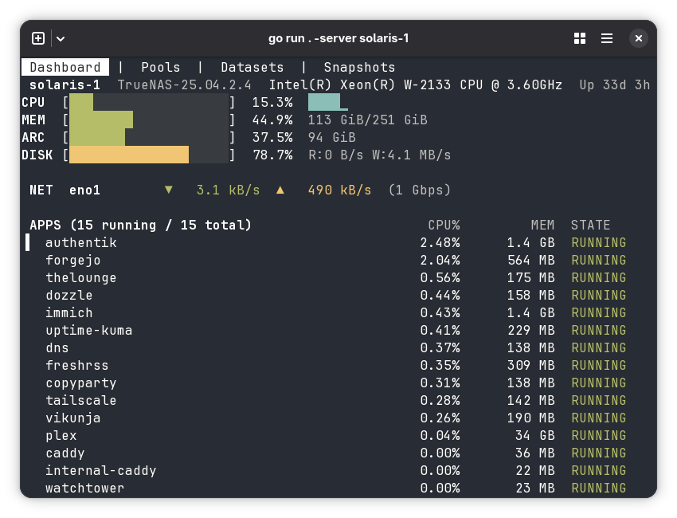

# truenas-tui

A terminal UI for managing TrueNAS servers.



## Install

```bash
go install github.com/deevus/truenas-tui@latest
```

## Configure

Create `~/.config/truenas-tui/config.toml`:

```toml
[servers.home]
host = "truenas.local"
port = 443
username = "admin"
api_key = "1-your-api-key"
insecure_skip_verify = true     # skip TLS certificate verification
```

Generate an API key in the TrueNAS web UI under **Credentials > API Keys**. TrueNAS uses a self-signed certificate by default, so `insecure_skip_verify = true` is needed unless you've configured a trusted certificate.

## Usage

```bash
# Single server (auto-selected)
truenas-tui

# Multiple servers — specify which one
truenas-tui --server home

# Custom config path
truenas-tui --config /path/to/config.toml
```

## Keybindings

| Key | Action |
|-----|--------|
| `q` | Quit |
| `1` / `2` / `3` / `4` | Switch tabs (Dashboard / Pools / Datasets / Snapshots) |
| `Tab` / `Shift+Tab` | Next / previous tab |
| `j` / `k` / `Down` / `Up` | Navigate list |
| `r` | Refresh current view |
